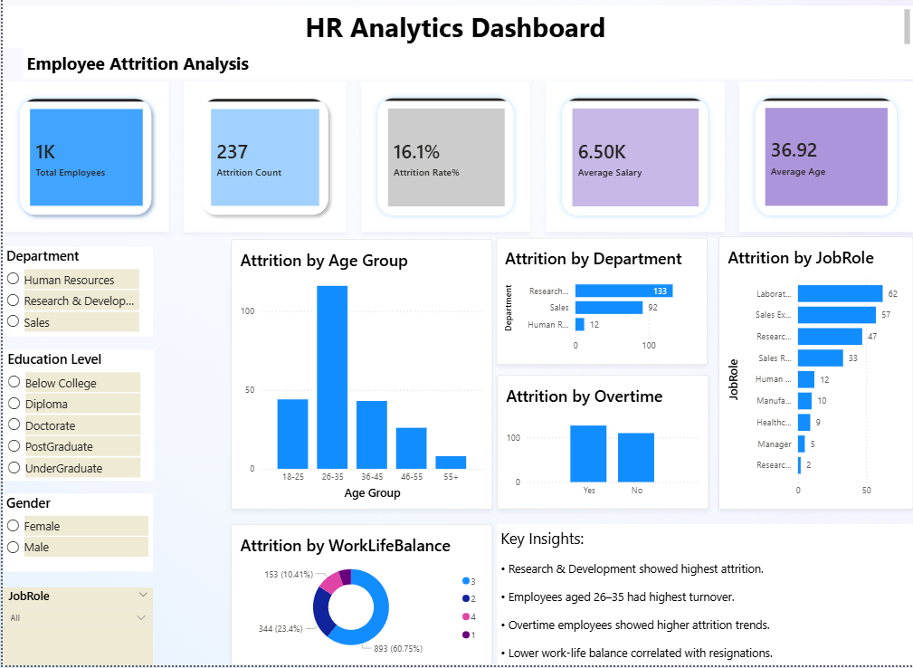

# HR Analytics Dashboard | Power BI

## Project Overview
This project is an interactive HR Analytics dashboard built using Power BI to analyze employee attrition trends and workforce patterns.

The dashboard helps identify:
- Attrition trends by department
- Employee turnover by age group
- Overtime impact on attrition
- Work-life balance patterns
- Job role-wise attrition analysis

## Tools & Technologies Used
- Power BI
- Power Query
- DAX
- Data Visualization
- CSV Dataset

## Key Features
- Interactive slicers and filters
- KPI cards for quick insights
- Attrition analysis by department, age group, and job role
- Work-life balance and overtime analysis
- Business insights section

## KPIs Included
- Total Employees
- Attrition Count
- Attrition Rate
- Average Salary
- Average Age

## Business Insights
- Research & Development showed highest attrition.
- Employees aged 26–35 had highest turnover.
- Overtime employees showed higher attrition trends.
- Lower work-life balance correlated with resignations.

## Dashboard Screenshot

## Project Files
- Power BI Dashboard (.pbix)
- Dataset (.csv)
- Dashboard Screenshot

